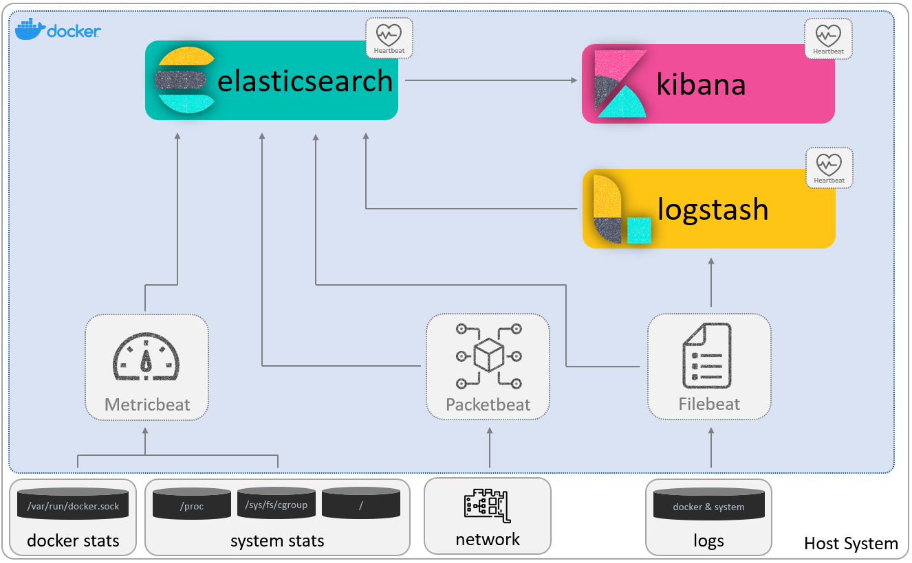

[](https://commerce.coinbase.com/checkout/faf64f90-2e80-46ee-aeba-0fde14cbeb46)
[](https://www.paypal.com/donate?hosted_button_id=GTSXAJQEBZ7XG)

# Elastic Stack Demo

Hello friends! Here are a few examples on how to deploy Elastic Stack using docker. It is part of a series in which by 
using examples, we deploy a series of Beats, Logstash, Elasticsearch and Kibana in a dockerized environment. Hope you
enjoy it. The below image, is a representation of the final architecture.



* [Introduction to Elastic Stack](https://www.canchito-dev.com/public/blog/2021/12/26/introduction-to-elastic-stack/).
* [Deploying Elastic Stack Cluster (single node) in docker](https://www.canchito-dev.com/public/blog/2021/12/26/deploying-elastic-stack-cluster-single-node-in-docker/).
* [Introduction to Elastic Stack Beats](http://www.canchito-dev.com/public/blog/2022/01/02/elastic-stack-beats/)
* [Deploying Filebeat in docker](http://www.canchito-dev.com/public/blog/2021/12/31/deploying-filebeat-in-docker/)
* [Getting Started with Logstash](http://www.canchito-dev.com/public/blog/2022/01/16/getting-started-with-logstash/)
* [Collect Metrics with Metricbet](https://www.canchito-dev.com/public/blog/2022/01/25/collect-metrics-with-metricbet/)
* [Know if your Service is Available with Heartbeat](https://www.canchito-dev.com/public/blog/2022/01/30/know-if-your-service-is-available-with-heartbeat/)
* [Capturing the network traffic with Packetbeat](https://www.canchito-dev.com/public/blog/2022/01/31/capturing-the-network-traffic-with-packetbeat/)
* [Audit the activities of users and processes on your systems with Auditbeat](http://www.canchito-dev.com/public/blog/2022/02/05/audit-the-activities-of-users-and-processes-on-your-systems-with-auditbeat)

In order to make the deployment much easier, we have created two scripts:
* ```start-all-single-node.sh```: Starts all the containers and verifies they are up and running.
* ```stop-all-single-node.sh```: Stops all the containers and performs a clean up.